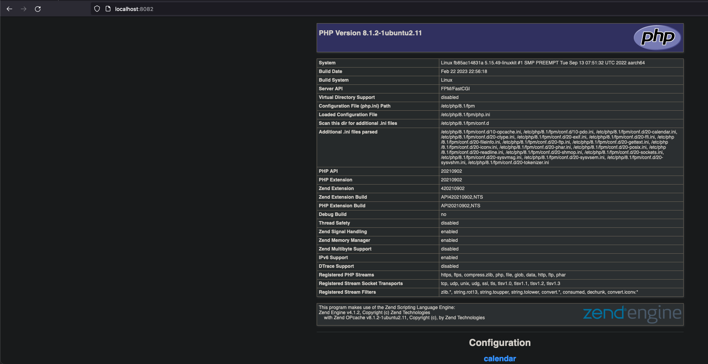

Tutorial setup following Saltstack guidelines at https://insuranceisi.atlassian.net/wiki/spaces/INFRA/pages/3431891004/SysOps+New+Joiner

Setup docker engine locally on my macbook and started multiple containers that were 1 for master 3 for minions

Started multiple containers with port forwarding for 8080:80 and incremented upwards for each number

    ➜  ~ docker run -it -d -p 8082:80 ubuntu:22.04
    fb85ac14831a1761513de47cbd41c7c9d798485d27ccfebba8a0a41745b24a1c
    ➜  ~ docker ps -a
    CONTAINER ID   IMAGE          COMMAND       CREATED              STATUS              PORTS                  NAMES
    fb85ac14831a   ubuntu:22.04   "/bin/bash"   About a minute ago   Up About a minute   0.0.0.0:8082->80/tcp   stoic_wright
    65cda862cad8   ubuntu:22.04   "/bin/bash"   2 hours ago          Up 2 hours          0.0.0.0:8081->80/tcp   inspiring_dijkstra
    43c3f474f838   ubuntu:22.04   "/bin/bash"   3 days ago           Up 5 hours          0.0.0.0:8080->80/tcp   wonderful_poitras
    b1ec71fc7e10   ubuntu:22.04   "/bin/bash"   3 days ago           Up 5 hours                                 serene_varahamihira
    566fc2a195cc   ubuntu:22.04   "/bin/bash"   3 days ago           Up 7 hours                                 nice_franklin

Configured the salt master
        
    add-apt-repository ppa:saltstack/salt
    apt-get update
    apt install software-properties-common
    apt update
    apt install salt-master
    vim /etc/salt/master

Changed on /etc/salt/master the default configs with contents from salt.infra.isi.systems

    ## /etc/salt/master
    state_output: changes
    auto_accept: True

Added on each container the salt minion prerequisites i.e 

    apt update && apt install -y salt-minion

Changed default minion configs with values I learned from the landscape

    ## /etc/salt/minion
    master: 172.17.0.4
    startup_states: 'highstate'
    metadata_server_grains: True

Restarted the minions with service salt-minion restart after also changing /etc/salt/minion_id files with custom naming convention docker0{1..4}

Registered the minions on the master with their own request i.e 

    root@566fc2a195cc:~# salt-key -a docker03
    The following keys are going to be accepted:
    Unaccepted Keys:
    docker03
    Proceed? [n/Y] y
    Key for minion docker03 accepted.
    root@566fc2a195cc:~#

Tested they are all reachable on the network for the master node

    root@566fc2a195cc:~# salt '*' test.ping
    docker03:
        True
    docker01:
        True
    docker02:
        True

Checked salt configs on ubuntu 22.04 for defaults that might break the system (learned to check these AFTER they broke it)

    root@566fc2a195cc:~# salt-call --local config.get file_roots
    local:
        ----------
        base:
            - /srv/salt
            - /srv/spm/salt
    root@566fc2a195cc:~# salt-call --local config.get pillar_roots
    local:
        ----------
        base:
            - /srv/pillar
            - /srv/spm/pillar

Per these, I added pillar data from pillar to /srv/pillar and the states + conf files to /srv/salt
Checked that the pillar values are readily available to the minions with

    root@566fc2a195cc:~# salt '*' pillar.items
    docker01:
        ----------
        php:
            ----------
            max_children:
                10
    docker02:
        ----------
        php:
            ----------
            max_children:
                10

Added the rest of the sls files and the config files for the requirements:
1. Install bash, vim, curl => aptitude/
2. Create an admin user who is allowed to sudo to root => users/
3. Install and configure a basic FEMP stack => nginx/, php-fpm/ and mysql/
4. Setup a basic website in directory /usr/local/www/default => nginx/, php-fpm/ and mysql/

Worked though many iterations to check that the state can apply with commands such as 

    salt '*' state.apply test=True

Per final state of entire environment, every container is up-to-date

    root@566fc2a195cc:/srv/salt# salt '*' state.apply
    docker02:
      Name: mygroup - Function: group.present - Result: Clean Started: - 18:18:27.890104 Duration: 3.541 ms
      Name: admin - Function: user.present - Result: Clean Started: - 18:18:27.893946 Duration: 21.831 ms
      Name: /etc/sudoers - Function: file.append - Result: Clean Started: - 18:18:27.923102 Duration: 1.944 ms
      Name: install_packages - Function: pkg.installed - Result: Clean Started: - 18:18:28.533837 Duration: 13.114 ms
      Name: mariadb-server - Function: pkg.installed - Result: Clean Started: - 18:18:28.547061 Duration: 4.587 ms
      Name: mariadb-client - Function: pkg.installed - Result: Clean Started: - 18:18:28.551731 Duration: 4.422 ms
      Name: python3-mysqldb - Function: pkg.installed - Result: Clean Started: - 18:18:28.556230 Duration: 4.354 ms
      Name: /etc/mysql/mariadb.conf.d/50-server.cnf - Function: file.append - Result: Clean Started: - 18:18:28.560665 Duration: 1.071 ms
      Name: mariadb - Function: service.running - Result: Clean Started: - 18:18:28.562240 Duration: 0.412 ms
      Name: root - Function: mysql_user.present - Result: Clean Started: - 18:18:28.562957 Duration: 8.362 ms
      Name: /usr/local/www/default - Function: file.directory - Result: Clean Started: - 18:18:28.571405 Duration: 0.788 ms
      Name: /usr/local/www/default/index.php - Function: file.managed - Result: Clean Started: - 18:18:28.572252 Duration: 9.63 ms
      Name: nginx - Function: pkg.installed - Result: Clean Started: - 18:18:28.582019 Duration: 4.456 ms
      Name: /etc/nginx/sites-available/default - Function: file.managed - Result: Clean Started: - 18:18:28.586668 Duration: 5.317 ms
      Name: nginx - Function: service.running - Result: Clean Started: - 18:18:28.592070 Duration: 0.323 ms
      Name: php-fpm - Function: pkg.installed - Result: Clean Started: - 18:18:28.592460 Duration: 4.036 ms
      Name: /etc/php/8.1/fpm/pool.d/www.conf - Function: file.managed - Result: Clean Started: - 18:18:28.596664 Duration: 10.031 ms
      Name: php8.1-fpm - Function: service.running - Result: Clean Started: - 18:18:28.606770 Duration: 0.304 ms
    
    Summary for docker02
    -------------
    Succeeded: 18
    Failed:     0
    -------------
    Total states run:     18
    Total run time:   98.523 ms
    docker04:
      Name: mygroup - Function: group.present - Result: Clean Started: - 18:18:27.911044 Duration: 3.2 ms
      Name: admin - Function: user.present - Result: Clean Started: - 18:18:27.914552 Duration: 14.641 ms
      Name: /etc/sudoers - Function: file.append - Result: Clean Started: - 18:18:27.930238 Duration: 2.268 ms
      Name: install_packages - Function: pkg.installed - Result: Clean Started: - 18:18:28.535355 Duration: 12.295 ms
      Name: mariadb-server - Function: pkg.installed - Result: Clean Started: - 18:18:28.547728 Duration: 4.594 ms
      Name: mariadb-client - Function: pkg.installed - Result: Clean Started: - 18:18:28.552395 Duration: 4.515 ms
      Name: python3-mysqldb - Function: pkg.installed - Result: Clean Started: - 18:18:28.557018 Duration: 4.332 ms
      Name: /etc/mysql/mariadb.conf.d/50-server.cnf - Function: file.append - Result: Clean Started: - 18:18:28.561407 Duration: 1.754 ms
      Name: mariadb - Function: service.running - Result: Clean Started: - 18:18:28.563649 Duration: 0.254 ms
      Name: root - Function: mysql_user.present - Result: Clean Started: - 18:18:28.564133 Duration: 5.72 ms
      Name: /usr/local/www/default - Function: file.directory - Result: Clean Started: - 18:18:28.569924 Duration: 0.72 ms
      Name: /usr/local/www/default/index.php - Function: file.managed - Result: Clean Started: - 18:18:28.570694 Duration: 9.218 ms
      Name: nginx - Function: pkg.installed - Result: Clean Started: - 18:18:28.580003 Duration: 4.35 ms
      Name: /etc/nginx/sites-available/default - Function: file.managed - Result: Clean Started: - 18:18:28.584514 Duration: 6.058 ms
      Name: nginx - Function: service.running - Result: Clean Started: - 18:18:28.591077 Duration: 0.367 ms
      Name: php-fpm - Function: pkg.installed - Result: Clean Started: - 18:18:28.591496 Duration: 4.253 ms
      Name: /etc/php/8.1/fpm/pool.d/www.conf - Function: file.managed - Result: Clean Started: - 18:18:28.595935 Duration: 8.485 ms
      Name: php8.1-fpm - Function: service.running - Result: Clean Started: - 18:18:28.604490 Duration: 0.279 ms
    
    Summary for docker04
    -------------
    Succeeded: 18
    Failed:     0
    -------------
    Total states run:     18
    Total run time:   87.303 ms
    docker03:
      Name: mygroup - Function: group.present - Result: Clean Started: - 18:18:27.896905 Duration: 3.208 ms
      Name: admin - Function: user.present - Result: Clean Started: - 18:18:27.900485 Duration: 14.516 ms
      Name: /etc/sudoers - Function: file.append - Result: Clean Started: - 18:18:27.916048 Duration: 3.439 ms
      Name: install_packages - Function: pkg.installed - Result: Clean Started: - 18:18:28.533299 Duration: 32.084 ms
      Name: mariadb-server - Function: pkg.installed - Result: Clean Started: - 18:18:28.565453 Duration: 4.38 ms
      Name: mariadb-client - Function: pkg.installed - Result: Clean Started: - 18:18:28.569889 Duration: 4.262 ms
      Name: python3-mysqldb - Function: pkg.installed - Result: Clean Started: - 18:18:28.574212 Duration: 4.284 ms
      Name: /etc/mysql/mariadb.conf.d/50-server.cnf - Function: file.append - Result: Clean Started: - 18:18:28.578558 Duration: 1.062 ms
      Name: mariadb - Function: service.running - Result: Clean Started: - 18:18:28.580049 Duration: 0.225 ms
      Name: root - Function: mysql_user.present - Result: Clean Started: - 18:18:28.580468 Duration: 5.133 ms
      Name: /usr/local/www/default - Function: file.directory - Result: Clean Started: - 18:18:28.585665 Duration: 0.703 ms
      Name: /usr/local/www/default/index.php - Function: file.managed - Result: Clean Started: - 18:18:28.586412 Duration: 11.153 ms
      Name: nginx - Function: pkg.installed - Result: Clean Started: - 18:18:28.597635 Duration: 4.527 ms
      Name: /etc/nginx/sites-available/default - Function: file.managed - Result: Clean Started: - 18:18:28.602341 Duration: 4.997 ms
      Name: nginx - Function: service.running - Result: Clean Started: - 18:18:28.607404 Duration: 0.281 ms
      Name: php-fpm - Function: pkg.installed - Result: Clean Started: - 18:18:28.607726 Duration: 4.631 ms
      Name: /etc/php/8.1/fpm/pool.d/www.conf - Function: file.managed - Result: Clean Started: - 18:18:28.612561 Duration: 13.433 ms
      Name: php8.1-fpm - Function: service.running - Result: Clean Started: - 18:18:28.626074 Duration: 0.281 ms
    
    Summary for docker03
    -------------
    Succeeded: 18
    Failed:     0
    -------------
    Total states run:     18
    Total run time:  112.599 ms
    docker01:
      Name: mygroup - Function: group.present - Result: Clean Started: - 18:18:27.920138 Duration: 9.444 ms
      Name: admin - Function: user.present - Result: Clean Started: - 18:18:27.929943 Duration: 35.23 ms
      Name: /etc/sudoers - Function: file.append - Result: Clean Started: - 18:18:27.966132 Duration: 2.261 ms
      Name: install_packages - Function: pkg.installed - Result: Clean Started: - 18:18:28.562487 Duration: 10.558 ms
      Name: mariadb-server - Function: pkg.installed - Result: Clean Started: - 18:18:28.573130 Duration: 4.576 ms
      Name: mariadb-client - Function: pkg.installed - Result: Clean Started: - 18:18:28.577798 Duration: 4.443 ms
      Name: python3-mysqldb - Function: pkg.installed - Result: Clean Started: - 18:18:28.582326 Duration: 4.178 ms
      Name: /etc/mysql/mariadb.conf.d/50-server.cnf - Function: file.append - Result: Clean Started: - 18:18:28.586576 Duration: 1.21 ms
      Name: mariadb - Function: service.running - Result: Clean Started: - 18:18:28.588336 Duration: 0.306 ms
      Name: root - Function: mysql_user.present - Result: Clean Started: - 18:18:28.588999 Duration: 5.454 ms
      Name: /usr/local/www/default - Function: file.directory - Result: Clean Started: - 18:18:28.594539 Duration: 0.906 ms
      Name: /usr/local/www/default/index.php - Function: file.managed - Result: Clean Started: - 18:18:28.595508 Duration: 9.773 ms
      Name: nginx - Function: pkg.installed - Result: Clean Started: - 18:18:28.605395 Duration: 4.502 ms
      Name: /etc/nginx/sites-available/default - Function: file.managed - Result: Clean Started: - 18:18:28.610135 Duration: 5.2 ms
      Name: nginx - Function: service.running - Result: Clean Started: - 18:18:28.615418 Duration: 0.325 ms
      Name: php-fpm - Function: pkg.installed - Result: Clean Started: - 18:18:28.615800 Duration: 4.487 ms
      Name: /etc/php/8.1/fpm/pool.d/www.conf - Function: file.managed - Result: Clean Started: - 18:18:28.620497 Duration: 8.406 ms
      Name: php8.1-fpm - Function: service.running - Result: Clean Started: - 18:18:28.629008 Duration: 0.327 ms
    
    Summary for docker01
    -------------
    Succeeded: 18
    Failed:     0
    -------------
    Total states run:     18
    Total run time:  111.586 ms
    root@566fc2a195cc:/srv/salt#

Per screenshot included in this repo, I am able to get php_info on forwarded port from one of the containers

